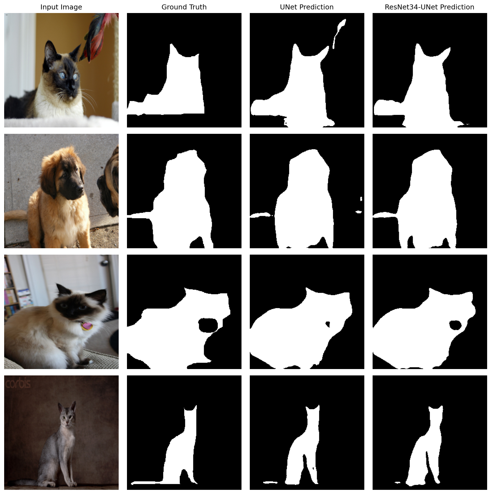

# Binary Semantic Segmentation on the Oxford-IIIT Pet Dataset

**From-scratch UNet and ResNet34-UNet implementations in PyTorch, trained end-to-end for pixel-wise foreground/background segmentation.**

> Deep Learning course lab (NYCU, cross-institution TAICA program) — reimplemented and extended as a standalone project.

---

## Abstract

This project implements and compares two convolutional encoder-decoder architectures — a vanilla **UNet** and a **ResNet34-style UNet** (residual encoder built from scratch, no pretrained weights) — for binary semantic segmentation on the [Oxford-IIIT Pet Dataset](https://www.robots.ox.ac.uk/~vgg/data/pets/). Both networks are trained to separate pet foreground from background using the dataset's trimap annotations collapsed to a binary mask. The pipeline covers custom data augmentation, a combined BCE + Dice loss, mixed-precision training, cosine/plateau learning-rate scheduling, and test-time augmentation (horizontal-flip ensembling) with morphological post-processing at inference. The ResNet34-UNet reaches a **validation Dice score of 0.9165**, outperforming the vanilla UNet baseline at **0.9122**.

---

## 專案摘要

本專案在 [Oxford-IIIT Pet Dataset](https://www.robots.ox.ac.uk/~vgg/data/pets/) 上實作並比較兩種 encoder–decoder 架構的二元語意分割（binary semantic segmentation）模型：從零實作的 **UNet**，以及自行搭建（未使用 ImageNet 預訓練權重）的 **ResNet34-UNet**。兩者皆以資料集提供的 trimap 標註轉換而成的二元遮罩（前景／背景）作為訓練目標。整個 pipeline 包含資料增強、BCE + Dice 混合損失函數、混合精度訓練（AMP）、cosine / plateau 學習率排程，以及推論階段的水平翻轉測試時增強（TTA）與形態學後處理。最終 ResNet34-UNet 在驗證集上取得 **Dice 0.9165**，優於 UNet baseline 的 **0.9122**。

---

## 1. 問題定義（Problem Formulation）

給定一張寵物影像 $x \in \mathbb{R}^{H \times W \times 3}$，模型需預測一張二元遮罩 $\hat{y} \in \{0,1\}^{H \times W}$，標示每個像素屬於「寵物本體」還是「背景」。Ground truth 來自 Oxford-IIIT Pet 的 trimap 標註（1 = 前景、2 = 背景、3 = 邊界），本專案將其二值化為 `mask == 1` 作為前景標籤，其餘視為背景，將原本三類的邊界分割問題簡化為二元分割任務。

## 2. 資料集（Dataset）

| | |
|---|---|
| 來源 | Oxford-IIIT Pet Dataset (Parkhi et al., 2012) |
| 影像數量 | 7,349 張（37 個貓狗品種） |
| 標註 | Trimap（前景 / 背景 / 邊界），二值化後作為分割目標 |
| Split | `trainval.txt` 內以固定亂數種子 `42` 切分 80% 訓練 / 20% 驗證；官方 `test.txt` 另作為 held-out 測試集（Kaggle 形式的競賽提交） |
| 輸入解析度 | Resize 至 256×256 |

資料集本身（含 `dataset.zip`, 約 812 MB）**未包含在本 repo 中**，請依下方〈重現步驟〉自行下載。

## 3. 方法（Methods）

### 3.1 模型架構

**UNet**（[`src/models/unet.py`](src/models/unet.py)）
標準的對稱 encoder-decoder，4 層下採樣（MaxPool + DoubleConv，64→1024 channels）搭配 4 層轉置卷積上採樣與 skip connection，最終以 1×1 卷積輸出單通道 logits。

**ResNet34-UNet**（[`src/models/resnet34_unet.py`](src/models/resnet34_unet.py)）
Encoder 依照 ResNet-34 的 block 配置（`[3, 4, 6, 3]` 個 `BasicBlock`，含 shortcut/downsample）由零手刻實作；Decoder 為對應的 5 層上採樣路徑，並在每一層與 encoder 的對應特徵圖做 skip connection concatenation。

> **架構筆記**：目前 `ResNet34_UNet` 建構子保留了 `pretrained` 參數，但尚未實作 ImageNet 預訓練權重載入邏輯，本次實驗中的 ResNet34-UNet 實際上是**從零訓練**（並非遷移學習）。這是後續可以改進的方向之一，見〈已知限制〉。

### 3.2 損失函數

- UNet baseline：`BCEWithLogitsLoss`
- ResNet34-UNet：自訂 `BCEDiceLoss`（[`src/train_resnet.py`](src/train_resnet.py)），以 `0.7 × BCE + 0.3 × Dice Loss` 加權組合，緩解前景/背景像素不平衡問題

### 3.3 資料增強（[`src/oxford_pet.py`](src/oxford_pet.py)）

僅在訓練階段套用：水平翻轉（p=0.5）、隨機旋轉 ±15°（p=0.5，mask 以 nearest-neighbor 插值保持標籤離散性）、亮度擾動（p=0.5，factor ∈ [0.8, 1.2]）。影像以 ImageNet 統計值做標準化。

### 3.4 訓練設定

| | UNet | ResNet34-UNet |
|---|---|---|
| Optimizer | Adam (lr=1e-4) | Adam (lr=1e-4) |
| LR Scheduler | `ReduceLROnPlateau` (factor=0.5, patience=3, 依 val Dice) | `CosineAnnealingLR` (T_max=epochs, eta_min=1e-6) |
| Epochs | 40 | 80 |
| Batch size | 16 | 16 |
| 混合精度 (AMP) | 否 | 是（`torch.amp.autocast` + `GradScaler`） |
| 隨機種子固定 | 否 | 是（seed=42，含 cuDNN deterministic） |

### 3.5 推論（Inference，[`src/inference.py`](src/inference.py) / [`src/inference_resnet.py`](src/inference_resnet.py)）

- **Test-Time Augmentation**：原圖與水平翻轉圖各推論一次，機率取平均後再二值化（threshold = 0.5）
- **形態學後處理**：對二值遮罩做 morphological closing（3×3 或 5×5 kernel）以平滑雜訊、填補小孔洞
- **RLE 編碼**：輸出以 run-length encoding 壓縮的遮罩，符合 Kaggle 風格的競賽提交格式

## 4. 結果（Results）

| Model | Val Dice Score |
|---|---|
| UNet (from scratch) | **0.9122** |
| ResNet34-UNet (from scratch) | **0.9165** |

殘差連接（residual connections）帶來的更深層特徵萃取能力，加上 BCE+Dice 混合損失與 AMP/cosine schedule 的訓練設定，使 ResNet34-UNet 在驗證集上取得約 0.43 個百分點的 Dice 提升。兩模型在官方 test split 上另有產生 Kaggle 形式的提交檔（`submission_unet.csv` / `submission_resnet_final.csv`，未納入本 repo，可透過 `src/inference*.py` 重現）。

### 4.1 質性結果（Qualitative Results）

隨機抽取 4 張驗證集影像，比較原圖、ground truth 遮罩與兩模型的預測結果：



可以觀察到 ResNet34-UNet 的邊界更貼合 ground truth、雜訊區塊（如第二列 UNet 在右上角的離群白色雜點）也更少，與量化的 Dice score 提升一致。

## 5. 專案結構（Repository Structure）

```
.
├── assets/
│   └── qualitative_results.png  # 原圖 / GT / 兩模型預測 並排比較
├── src/
│   ├── models/
│   │   ├── unet.py              # UNet
│   │   └── resnet34_unet.py     # ResNet34-style encoder + UNet decoder
│   ├── oxford_pet.py            # Dataset / augmentation
│   ├── train.py                 # 訓練 UNet
│   ├── train_resnet.py          # 訓練 ResNet34-UNet（BCEDiceLoss, AMP, cosine LR）
│   ├── evaluate.py              # 在驗證集上比較兩模型的 Dice score
│   ├── inference.py             # UNet 推論 + TTA + RLE 輸出
│   ├── inference_resnet.py      # ResNet34-UNet 推論 + TTA + RLE 輸出
│   └── utils.py                 # dice_score / rle_encode
├── DL_Lab2_H24111269_顏愷廷.ipynb  # Colab 執行流程（環境掛載、資料解壓、訓練/推論指令）
├── requirements.txt
└── README.md
```

`dataset/`, `dataset.zip`, `saved_models/*.pth`（權重檔）與課程作業 PDF 因檔案過大或版權因素未納入版本控制，詳見 `.gitignore`。

## 6. 重現步驟（Reproduction）

```bash
git clone https://github.com/ktyan0614-byte/oxford-pet-segmentation.git
cd oxford-pet-segmentation
pip install -r requirements.txt
```

1. 下載 [Oxford-IIIT Pet Dataset](https://www.robots.ox.ac.uk/~vgg/data/pets/)（images + annotations），解壓成如下結構：
   ```
   dataset/oxford-iiit-pet/
   ├── images/
   └── annotations/
       ├── trainval.txt
       ├── test.txt
       └── trimaps/
   ```
2. 本專案原始開發於 Google Colab，`src/train.py`、`src/train_resnet.py`、`src/inference*.py` 內的 `DATASET_ROOT` / `SAVE_DIR` 等路徑為 Colab Drive 掛載路徑，**本機執行前請先改成本地路徑**。
3. 訓練：
   ```bash
   python src/train.py          # UNet
   python src/train_resnet.py   # ResNet34-UNet
   ```
4. 評估 / 推論：
   ```bash
   python src/evaluate.py
   python src/inference.py
   python src/inference_resnet.py
   ```

## 7. 已知限制與未來改進方向（Known Limitations & Future Work）

這份 repo 忠實呈現課程作業當時的實作，以下是後續可以強化、也是有意留下的改進空間：

- **路徑寫死、缺乏設定檔**：目前訓練/推論腳本以 Colab Drive 絕對路徑硬編碼，尚未改為 `argparse` 或 config file（YAML/JSON），不利於本機或跨環境重現。
- **`pretrained` 參數未實作**：`ResNet34_UNet` 建構子保留 `pretrained` flag，但沒有載入 ImageNet 權重的邏輯，目前兩個模型都是從零訓練；之後可以比較「random init」vs「ImageNet pretrained encoder」的差異。
- **未保存訓練日誌 / 沒有實驗追蹤**：原始訓練在 Colab 上進行，過程僅印出 stdout（loss / val Dice per epoch），作業繳交時只保留最終權重與 Dice 結果，沒有留下逐 epoch 的 log 檔；之後可以整合 TensorBoard / Weights & Biases 記錄 loss curve、learning rate 變化，並保存 config 與 checkpoint 的對應關係。
- **單一固定 threshold**：推論時二值化門檻固定為 0.5，尚未針對驗證集做 threshold sweep 找最佳操作點。
- **缺乏單元測試**：Dataset、loss function、RLE encode/decode 等模組沒有對應的 unit test。
- **評估指標單一**：目前僅以 Dice score 衡量，可以再補充 IoU、pixel accuracy、邊界 F-score 等指標做更完整的分析。

## 8. 環境與依賴（Environment）

```
torch
torchvision
numpy
Pillow
tqdm
pandas
opencv-python
```

完整原始開發環境為 Google Colab（GPU runtime），詳見 [`DL_Lab2_H24111269_顏愷廷.ipynb`](DL_Lab2_H24111269_顏愷廷.ipynb) 中的操作說明。

## 9. Citation

```
@inproceedings{parkhi2012cats,
  title={Cats and dogs},
  author={Parkhi, Omkar M and Vedaldi, Andrea and Zisserman, Andrew and Jawahar, C. V.},
  booktitle={2012 IEEE Conference on Computer Vision and Pattern Recognition},
  year={2012}
}
```

## License

Code released under the [MIT License](LICENSE). The Oxford-IIIT Pet Dataset is distributed by its original authors under a [Creative Commons Attribution-ShareAlike 4.0 International License](https://creativecommons.org/licenses/by-sa/4.0/) and is not redistributed in this repository.
